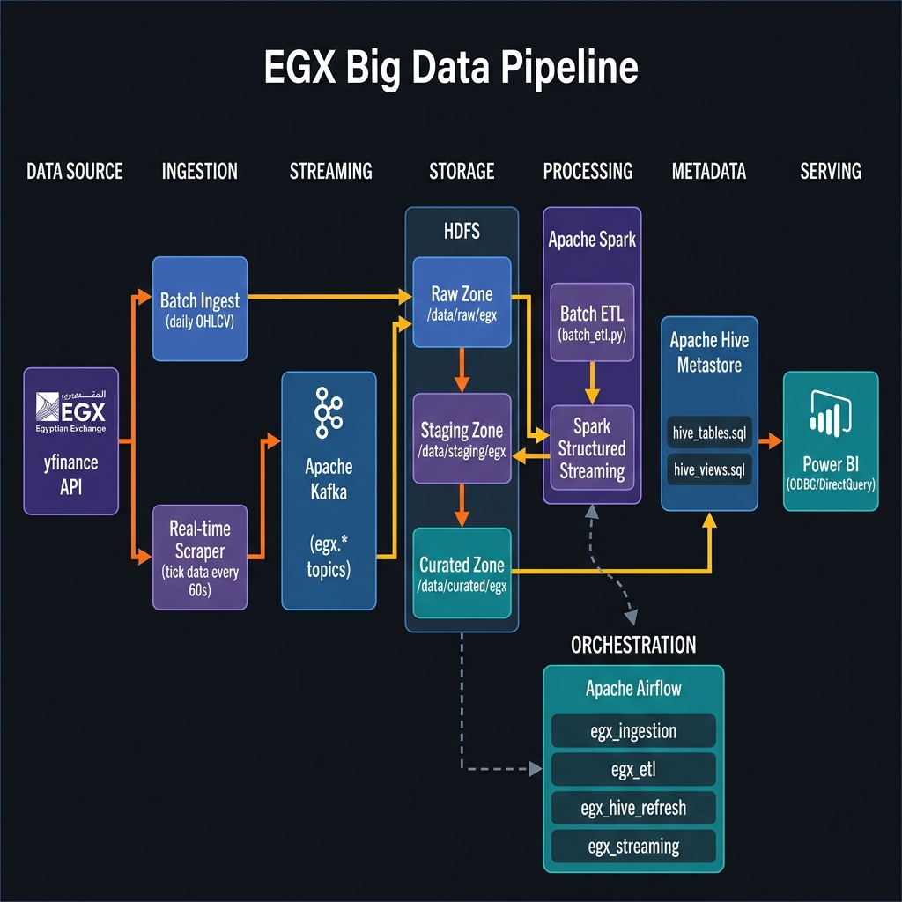
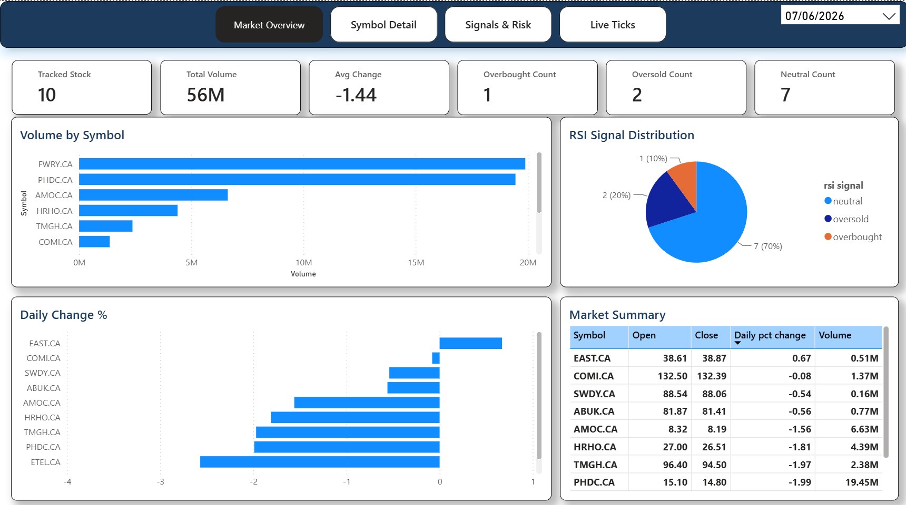
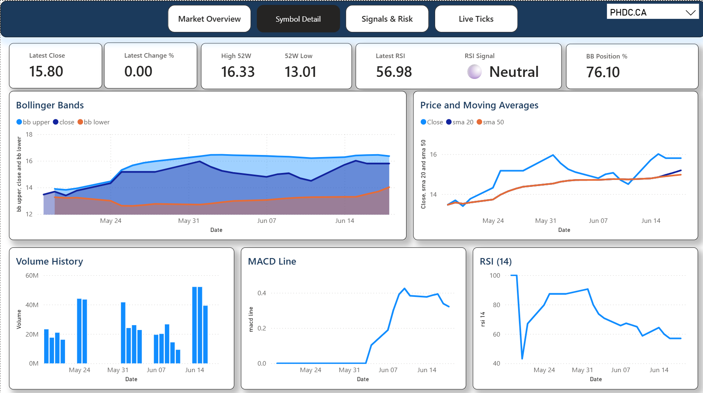
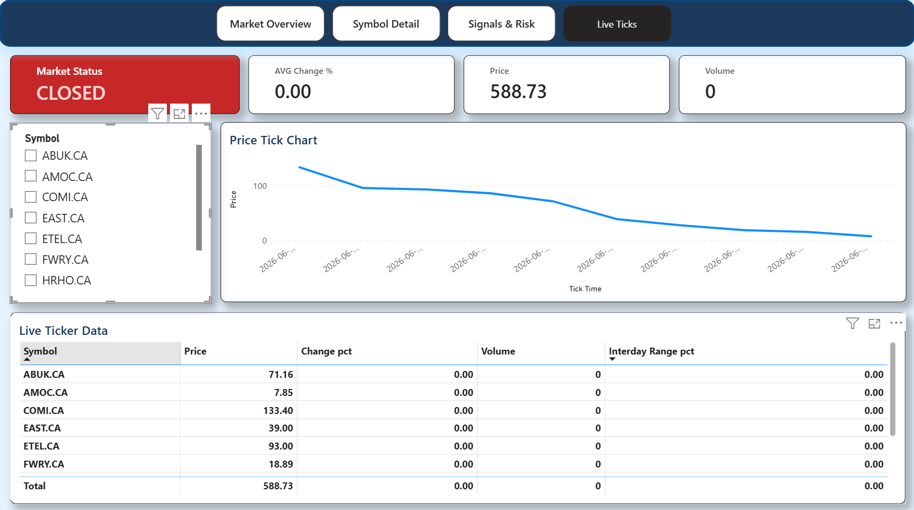

<h1 align="center">EGX Big Data Pipeline 🇪🇬📈</h1>

<p align="center">
  <strong>A production-grade, end-to-end big data pipeline for the Egyptian Exchange (EGX) stock market.</strong><br/>
  Batch &amp; real-time ingestion · Apache Spark ETL · Technical indicators · Hive data lake · Power BI DirectQuery dashboards
</p>

<p align="center">
  
  
  
  
  
  
  
</p>

---

## Table of Contents

- [Architecture Overview](#architecture-overview)
- [Dashboard Preview](#dashboard-preview)
- [Technology Stack](#technology-stack)
- [Repository Structure](#repository-structure)
- [Module Deep-Dives](#module-deep-dives)
  - [Ingestion](#1-ingestion)
  - [Storage (HDFS)](#2-storage-hdfs)
  - [Processing (Spark)](#3-processing-spark)
  - [Orchestration (Airflow)](#4-orchestration-airflow)
  - [Serving (Hive + Power BI)](#5-serving-hive--power-bi)
- [Infrastructure (Docker)](#infrastructure-docker)
- [Data Flow End-to-End](#data-flow-end-to-end)
- [HDFS Data Lake Layout](#hdfs-data-lake-layout)
- [Airflow DAG Schedule](#airflow-dag-schedule)
- [Hive Schema Reference](#hive-schema-reference)
- [Technical Indicators Reference](#technical-indicators-reference)
- [Getting Started](#getting-started)
- [Power BI Connection](#power-bi-connection)
- [Power BI Dashboard Docs](#power-bi-dashboard-documentation)

---

## Architecture Overview

The pipeline follows a **Lambda Architecture** pattern with both batch and streaming ingestion paths that converge in a unified HDFS data lake.

<p align="center">
  
</p>

---

## Dashboard Preview

The Power BI report consists of four interactive pages connected via DirectQuery to the Hive data lake.

> 📖 For detailed documentation of every visual, measure, and table, see the **[`powerbi/`](powerbi/)** folder.

<table>
  <tr>
    <td align="center" width="50%">
      <br/>
      <strong>Market Overview</strong><br/>
      <sub>KPIs · Volume ranking · Daily movers · RSI distribution</sub>
    </td>
    <td align="center" width="50%">
      <br/>
      <strong>Symbol Detail</strong><br/>
      <sub>Bollinger Bands · SMA/EMA · MACD · RSI · Volume</sub>
    </td>
  </tr>
  <tr>
    <td align="center" width="50%">
      <br/>
      <strong>Signals & Risk</strong><br/>
      <sub>RSI screening · Bollinger width · Risk scatter · Gauge</sub>
    </td>
    <td align="center" width="50%">
      <br/>
      <strong>Live Ticks</strong><br/>
      <sub>Market status · Intraday chart · Live ticker table</sub>
    </td>
  </tr>
</table>

---

## Technology Stack

| Component | Technology | Version | Purpose |
|---|---|---|---|
| Data Source | yfinance | latest | Fetch EGX OHLCV & tick data |
| Message Bus | Apache Kafka | 7.x (Confluent) | Real-time tick streaming |
| Distributed Storage | Apache Hadoop HDFS | 3.x | Persistent data lake |
| Batch Processing | Apache Spark (PySpark) | 3.4.1 | ETL + indicator computation |
| Stream Processing | Spark Structured Streaming | 3.4.1 | Real-time tick consumption |
| Table Metadata | Apache Hive | 2.x | Schema registry + SQL views |
| Orchestration | Apache Airflow | 2.x (Celery) | DAG scheduling |
| Containerization | Docker + Docker Compose | latest | All services in containers |
| BI / Reporting | Microsoft Power BI | Desktop | Dashboards via ODBC |
| ODBC Driver | Simba Hive ODBC | 2.6.26 | Power BI ↔ Hive bridge |

---

## Repository Structure

```
egx-bigdata-pipeline/
│
├── docs/
│   └── images/                     # Architecture diagram & dashboard screenshots
│
├── powerbi/                        # 📊 Power BI dashboard documentation
│   ├── README.md                   # Index: pages, data sources, navigation
│   ├── market_overview.md          # Page 1: Market overview visuals & measures
│   ├── symbol_detail.md            # Page 2: Single-stock technical analysis
│   ├── signals_and_risk.md         # Page 3: RSI screening & risk assessment
│   ├── live_ticks.md               # Page 4: Real-time tick monitoring
│   └── measures.md                 # Complete DAX measures catalogue
│
├── docker/                         # Container infrastructure
│   ├── docker-compose.yml          # Root compose: includes all sub-stacks
│   ├── .env                        # Airflow UID, Fernet key, secrets
│   ├── hadoop/                     # Hadoop NameNode, DataNode, YARN
│   ├── hive/                       # HiveServer2 + Metastore + PostgreSQL
│   ├── kafka/                      # Kafka broker + Zookeeper + Kafka UI
│   ├── spark/                      # Spark Master + Worker
│   └── airflow/                    # Airflow Webserver, Scheduler, Worker, Triggerer
│
├── ingestion/                      # Layer 1: Data ingestion
│   ├── config.py                   # Kafka broker, HDFS URL, scrape interval
│   ├── tickers.json                # List of EGX ticker symbols
│   ├── tickers.py                  # Helper to load tickers from JSON
│   ├── scraper.py                  # Real-time yfinance poller → Kafka producer
│   ├── producer.py                 # KafkaTickProducer class
│   └── batch_ingest.py             # Daily OHLCV batch fetch → HDFS raw zone
│
├── storage/                        # Layer 2: Storage layout
│   ├── hdfs_paths.py               # Central HDFS path constants (single source of truth)
│   └── init_hdfs.sh                # One-time HDFS directory initialisation script
│
├── processing/                     # Layer 3: Spark processing
│   ├── spark_config.py             # SparkSession factory (HDFS + Hive + Kafka config)
│   ├── batch_etl.py                # Raw → Staging → Curated ETL pipeline
│   ├── indicators.py               # PySpark technical indicator library
│   └── spark_streaming.py          # Structured Streaming: Kafka → HDFS raw/ticks
│
├── orchestration/                  # Layer 4: Airflow DAGs
│   ├── run_sql.py                  # CLI helper: runs HiveQL from DAGs
│   └── dags/
│       ├── ingestion_dag.py        # egx_ingestion: daily batch ingest
│       ├── etl_dag.py              # egx_etl: daily Spark ETL
│       ├── hive_refresh_dag.py     # egx_hive_refresh: refresh SQL views
│       └── streaming_dag.py        # egx_streaming: continuous tick scraper
│
├── serving/                        # Layer 5: BI layer
│   ├── hive_tables.sql             # DDL: raw_ohlcv + curated_ohlcv external tables
│   ├── hive_views.sql              # SQL views: daily summary, weekly rollup, RSI, etc.
│   └── powerbi_odbc.md             # Guide: connecting Power BI via Simba ODBC
│
└── config/
    └── hadoop/                     # Hadoop + Hive XML config files
```

---

## Module Deep-Dives

### 1. Ingestion

The ingestion layer has two independent paths that run concurrently.

#### 1a. Daily Batch Ingestion — `ingestion/batch_ingest.py`

Fetches historical OHLCV data for all tracked EGX tickers every trading day (Sunday–Thursday) after market close at 15:45 Cairo time.

**How it works:**
1. Loads the ticker list from `tickers.json`
2. Calls `yf.download()` for all tickers in a single vectorised request
3. Normalises column names (`Date` → `date`, `Close` → `close`, etc.)
4. Writes the data as a **Parquet** file to a date-partitioned HDFS path

**Output path:** `hdfs:///data/raw/egx/ohlcv/date_partition=YYYY-MM-DD/data.parquet`

**Tracked tickers:**

| Symbol | Company |
|---|---|
| `COMI.CA` | Commercial International Bank (CIB) |
| `FWRY.CA` | Fawry for Banking Technology |
| `TMGH.CA` | Talaat Mostafa Group |
| `SWDY.CA` | Elsewedy Electric |
| `EAST.CA` | Eastern Company |
| `HRHO.CA` | Hermes Financial Group |
| `ABUK.CA` | Abu Kir Fertilizers |
| `ETEL.CA` | Telecom Egypt |
| `AMOC.CA` | Alexandria Mineral Oils |
| `PHDC.CA` | Palm Hills Developments |

#### 1b. Real-Time Tick Scraper — `ingestion/scraper.py`

Polls yfinance every **60 seconds** and publishes live tick data to Apache Kafka.

**How it works:**
1. Creates a `KafkaTickProducer` instance
2. Schedules `scrape_all()` every `SCRAPE_INTERVAL_SECONDS` (60s) via APScheduler
3. For each ticker, calls `yf.Ticker(symbol).fast_info` for latest price, volume, open, high, low, and previous close
4. Publishes each tick as a JSON message to its dedicated Kafka topic

**Retry logic:** Each ticker fetch retries up to 3 times with a 5-second delay, then logs an error and skips.

#### 1c. Kafka Producer — `ingestion/producer.py`

The `KafkaTickProducer` wraps `kafka-python` with:
- **Delivery guarantee:** `acks="all"` (waits for all replicas)
- **Serialisation:** JSON-encoded UTF-8
- **Topic naming:** `egx.<symbol>` (dots replaced with underscores, e.g. `COMI.CA` → `egx.comi_ca`)
- **Retries:** 3 automatic retries on transient errors

---

### 2. Storage (HDFS)

#### Path Constants — `storage/hdfs_paths.py`

All HDFS paths are centralised to prevent hardcoded duplication across scripts.

```
/data/
├── raw/egx/
│   ├── ohlcv/           ← Daily OHLCV Parquet (date-partitioned)
│   └── ticks/           ← Real-time tick Parquet (Spark Streaming)
├── staging/egx/
│   └── ohlcv/           ← Cleaned, typed, de-duplicated OHLCV
└── curated/egx/
    └── ohlcv/           ← OHLCV + all technical indicators (symbol-partitioned)
```

#### Initialisation — `storage/init_hdfs.sh`

One-time bootstrap script that creates the HDFS directory tree and sets permissions:

```bash
docker exec egx-hadoop-namenode bash /opt/egx-pipeline/storage/init_hdfs.sh
```

---

### 3. Processing (Spark)

#### 3a. SparkSession Factory — `processing/spark_config.py`

Centralised `get_spark_session(app_name, include_kafka=False)` that configures:
- Spark master at `spark://egx-spark-master:7077`
- **Hive support** via Metastore (`thrift://egx-hive-metastore:9083`)
- **KryoSerializer** for performance
- Optional **Kafka connector JAR** for streaming jobs

#### 3b. Batch ETL — `processing/batch_etl.py`

Transforms raw OHLCV data through three HDFS zones:

```
Raw Zone → Staging Zone → Curated Zone
```

| Step | Description |
|---|---|
| 1. Read raw | Reads today's Parquet from the raw zone |
| 2. Clean → Staging | Drop nulls, filter invalid prices, cast types, de-duplicate on `(symbol, date)` |
| 3. Read all staging | Full historical dataset for rolling-window calculations |
| 4. Compute indicators | `add_all_indicators()` — pure PySpark window functions |
| 5. Write curated | Parquet partitioned by `symbol`, `ingested_at` cast to STRING for ODBC compatibility |

#### 3c. Technical Indicators — `processing/indicators.py`

Pure **PySpark window-function** library — no Pandas UDFs, no Python loops on executors.

| Function | Indicator | Parameters |
|---|---|---|
| `add_sma(df, period)` | Simple Moving Average | 20, 50 |
| `add_ema(df, period)` | Exponential Moving Average | 20 |
| `add_rsi(df, period)` | Relative Strength Index | 14 |
| `add_macd(df, fast, slow, signal)` | MACD line, signal, histogram | 12/26/9 |
| `add_bollinger(df, period, std_dev)` | Bollinger Bands (upper/mid/lower) | 20, 2σ |
| `add_all_indicators(df)` | Runs all of the above | — |

All indicators use `Window.partitionBy("symbol").orderBy("date")`.

#### 3d. Spark Structured Streaming — `processing/spark_streaming.py`

Consumes all EGX Kafka topics in real time:
- **Topic pattern:** `egx\..*` (regex subscription)
- **Output:** Parquet to `HDFS/data/raw/egx/ticks/`, partitioned by `date_partition` and `symbol`
- **Trigger:** Micro-batch every **30 seconds**
- **Checkpoint:** `HDFS/checkpoints/streaming/` for exactly-once semantics

---

### 4. Orchestration (Airflow)

All DAGs execute tasks via `docker exec egx-spark-master` for full access to HDFS, Hive, and Kafka.

#### DAG 1: `egx_ingestion`

| | |
|---|---|
| **Schedule** | `45 13 * * 0-4` — 15:45 Cairo, Sun–Thu |
| **Purpose** | Fetch OHLCV → HDFS raw zone → repair Hive partitions |

```
wait_for_market_close → run_batch_ingest → repair_hive_partitions
```

#### DAG 2: `egx_etl`

| | |
|---|---|
| **Schedule** | `15 14 * * 0-4` — 16:15 Cairo, 30 min after ingestion |
| **Purpose** | Spark ETL: raw → staging → curated with indicators |

```
wait_for_ingestion → run_spark_etl → repair_curated_partitions
```

#### DAG 3: `egx_hive_refresh`

| | |
|---|---|
| **Schedule** | `30 15 * * 0-4` — 17:30 Cairo, after ETL |
| **Purpose** | Re-create Hive SQL views for Power BI |

```
wait_for_etl → refresh_hive_views
```

#### DAG 4: `egx_streaming`

| | |
|---|---|
| **Schedule** | `@once` — runs continuously |
| **Purpose** | Launch tick scraper + Spark Streaming consumer |

```
run_consumer → run_scraper
```

---

### 5. Serving (Hive + Power BI)

#### 5a. Hive External Tables — `serving/hive_tables.sql`

Two **external tables** (Hive reads Parquet directly from HDFS):

- **`raw_ohlcv`** — partitioned by `date_partition`
- **`curated_ohlcv`** — partitioned by `symbol`, all columns with `COMMENT` to prevent Simba ODBC NPE
- **`raw_ticks`** — partitioned by `date_partition` and `symbol`

#### 5b. Hive Views — `serving/hive_views.sql`

| View | Description |
|---|---|
| `v_daily_summary` | Full price + indicator snapshot per day per symbol |
| `v_weekly_rollup` | Weekly OHLCV aggregated from daily data |
| `v_top_movers` | Biggest movers on the latest trading day |
| `v_rsi_signals` | RSI signal classification (overbought/oversold/neutral) |
| `v_bollinger_squeeze` | Bollinger Band width — highlights volatility squeeze |
| `v_latest_ticks` | Most recent tick per symbol (today only, with market status) |
| `v_tick_history` | All intraday ticks for today (line chart data) |

---

## Infrastructure (Docker)

All services run in Docker containers on the `egx-network` bridge network.

### Launch

```bash
cd docker
docker compose -f docker-compose.yml up -d
```

### Services & Ports

| Service | Container | Port | Purpose |
|---|---|---|---|
| HDFS NameNode | `egx-hadoop-namenode` | `9870` | HDFS Web UI |
| HDFS DataNode | `egx-hadoop-datanode` | `9864` | Storage node |
| YARN ResourceManager | `egx-hadoop-resourcemanager` | `8088` | YARN Web UI |
| Hive Metastore | `egx-hive-metastore` | `9083` | Thrift metastore |
| HiveServer2 | `egx-hive-server` | `10000` | JDBC/ODBC endpoint |
| Kafka | `egx-kafka` | `9092` | Message broker |
| Zookeeper | `egx-zookeeper` | `2181` | Kafka coordination |
| Kafka UI | `egx-kafka-ui` | `8080` | Topic browser |
| Spark Master | `egx-spark-master` | `8081` | Spark Web UI |
| Spark Worker | `egx-spark-worker` | `8082` | Worker node |
| Airflow Webserver | `egx-airflow-webserver` | `8082` | Airflow UI |
| Airflow Scheduler | `egx-airflow-scheduler` | — | DAG scheduler |
| Airflow Worker | `egx-airflow-worker` | — | Celery executor |
| Airflow Triggerer | `egx-airflow-triggerer` | — | Deferred triggers |

---

## Data Flow End-to-End

```
[Daily, 13:45 UTC]
yfinance API
    ↓
ingestion/batch_ingest.py
    ↓ writes Parquet
HDFS: /data/raw/egx/ohlcv/date_partition=YYYY-MM-DD/
    ↓ MSCK REPAIR
Hive Metastore: raw_ohlcv table updated
    ↓ ExternalTaskSensor waits
processing/batch_etl.py (Spark)
    ├── Reads raw partition
    ├── Cleans → /data/staging/egx/ohlcv/
    ├── Computes SMA-20, SMA-50, EMA-20, RSI-14, MACD(12,26,9), Bollinger(20)
    └── Writes /data/curated/egx/ohlcv/symbol=<TICKER>/
    ↓ MSCK REPAIR
Hive views refreshed
    ↓
Power BI DirectQuery via Simba ODBC (port 10000)

[Continuous, every 60s]
yfinance fast_info → Kafka (egx.*) → Spark Streaming → HDFS ticks
```

---

## HDFS Data Lake Layout

The pipeline uses a **medallion architecture** with three zones:

| Zone | Path | Format | Partitioning | Content |
|---|---|---|---|---|
| **Raw** | `/data/raw/egx/ohlcv/` | Parquet | `date_partition` | As-is from yfinance |
| **Raw Ticks** | `/data/raw/egx/ticks/` | Parquet | `date_partition`, `symbol` | Real-time tick snapshots |
| **Staging** | `/data/staging/egx/ohlcv/` | Parquet | `date_partition` | Cleaned, typed, de-duplicated |
| **Curated** | `/data/curated/egx/ohlcv/` | Snappy Parquet | `symbol` | OHLCV + all indicators |

---

## Airflow DAG Schedule

| DAG ID | Cron | Cairo Time | Description |
|---|---|---|---|
| `egx_ingestion` | `45 13 * * 0-4` | 15:45 Sun–Thu | Batch ingest after market close |
| `egx_etl` | `15 14 * * 0-4` | 16:15 Sun–Thu | Spark ETL pipeline |
| `egx_hive_refresh` | `30 15 * * 0-4` | 17:30 Sun–Thu | Refresh Hive views |
| `egx_streaming` | `@once` | Continuous | Real-time tick pipeline |

**Airflow UI:** http://localhost:8082 — `admin` / `admin`

---

## Hive Schema Reference

### `egx_db.curated_ohlcv`

| Column | Type | Description |
|---|---|---|
| `date` | DATE | Trading date |
| `open` | DOUBLE | Opening price |
| `high` | DOUBLE | Intraday high |
| `low` | DOUBLE | Intraday low |
| `close` | DOUBLE | Closing price |
| `volume` | BIGINT | Total shares traded |
| `sma_20` | DOUBLE | 20-day Simple Moving Average |
| `sma_50` | DOUBLE | 50-day Simple Moving Average |
| `ema_20` | DOUBLE | 20-day Exponential Moving Average |
| `rsi_14` | DOUBLE | 14-day RSI (0–100) |
| `macd_line` | DOUBLE | MACD line (EMA12 − EMA26) |
| `macd_signal` | DOUBLE | 9-day EMA of MACD line |
| `macd_hist` | DOUBLE | MACD histogram |
| `bb_upper` | DOUBLE | Bollinger Upper Band (SMA20 + 2σ) |
| `bb_mid` | DOUBLE | Bollinger Middle Band (SMA20) |
| `bb_lower` | DOUBLE | Bollinger Lower Band (SMA20 − 2σ) |
| `ingested_at` | STRING | UTC processing timestamp |
| `symbol` | STRING | EGX ticker (partition key) |

---

## Technical Indicators Reference

| Indicator | Formula | Interpretation |
|---|---|---|
| **SMA-20** | Avg(close, 20d) | Short-term trend |
| **SMA-50** | Avg(close, 50d) | Medium-term trend |
| **EMA-20** | Weighted avg, recent bias | Faster trend signal |
| **RSI-14** | 100 − 100/(1 + gain/loss) | >70 overbought, <30 oversold |
| **MACD Line** | EMA(12) − EMA(26) | Momentum direction |
| **MACD Signal** | EMA(9) of MACD | Smoothed reference |
| **MACD Histogram** | Line − Signal | Convergence/divergence |
| **Bollinger Upper** | SMA(20) + 2σ | Overbought zone |
| **Bollinger Lower** | SMA(20) − 2σ | Oversold zone |

---

## Getting Started

### Prerequisites

- **Docker Desktop** (Windows/Mac) or Docker Engine + Compose (Linux)
- **16 GB RAM** allocated to Docker (Hadoop + Spark + Kafka are memory-hungry)
- **20 GB** free disk space
- Python 3.10+ (local development only)

### Step 1: Clone & Configure

```bash
git clone <repo-url>
cd egx-bigdata-pipeline
```

Generate a Fernet key for Airflow:
```bash
python -c "from cryptography.fernet import Fernet; print(Fernet.generate_key().decode())"
```

Update `docker/.env`:
```env
AIRFLOW_UID=50000
AIRFLOW_EXECUTOR=CeleryExecutor
AIRFLOW_SECRET_KEY=egx-dev-secret-key
AIRFLOW_FERNET_KEY=<paste your generated key>
```

### Step 2: Start Services

```bash
cd docker
docker compose -f docker-compose.yml up -d
```

Wait ~2 minutes for health checks, then verify:
```bash
docker compose -f docker-compose.yml ps
```

### Step 3: Initialise HDFS

```bash
docker exec egx-hadoop-namenode bash /opt/egx-pipeline/storage/init_hdfs.sh
```

### Step 4: Register Hive Tables

```bash
# Windows (PowerShell)
Get-Content serving/hive_tables.sql | docker exec -i egx-hive-server hive

# Linux / macOS
cat serving/hive_tables.sql | docker exec -i egx-hive-server hive
```

### Step 5: Run Initial Pipeline

```bash
# Ingest today's OHLCV data
docker exec egx-airflow-worker bash -c "cd /opt/egx-pipeline && python -m ingestion.batch_ingest"

# Run ETL
docker exec egx-spark-master bash -c "cd /opt/egx-pipeline && python3 -m processing.batch_etl"

# Repair Hive partitions
docker exec egx-hive-server hive -e "MSCK REPAIR TABLE egx_db.curated_ohlcv;"

# Create analytical views
cat serving/hive_views.sql | docker exec -i egx-hive-server hive
```

### Step 6: Access UIs

| UI | URL | Credentials |
|---|---|---|
| Airflow | http://localhost:8082 | admin / admin |
| Spark | http://localhost:8081 | — |
| Kafka UI | http://localhost:8080 | — |
| HDFS NameNode | http://localhost:9870 | — |
| YARN | http://localhost:8088 | — |

---

## Power BI Connection

1. Install [Simba Hive ODBC Driver v2.6.26 (64-bit)](https://www.cloudera.com/downloads/connectors/hive/odbc/2-6-26.html)
2. Create a DSN in **ODBC Data Sources (64-bit)**:
   - **DSN Name:** `EGX_Hive` · **Host:** `localhost` · **Port:** `10000` · **Database:** `egx_db` · **Auth:** None
3. In Power BI: **Get Data → ODBC → Advanced Options → SQL statement** (do not use the Navigator — see [known bug](serving/powerbi_odbc.md#-odbc-error-hy000-clouderahardy-35-metaexceptionnullpointerexception))
4. Select **DirectQuery** mode

---

## Power BI Dashboard Documentation

Comprehensive documentation for every dashboard page, visual, and DAX measure is available in the **[`powerbi/`](powerbi/)** folder:

| Document | Contents |
|---|---|
| [`powerbi/README.md`](powerbi/README.md) | Index — pages, data sources, navigation |
| [`powerbi/market_overview.md`](powerbi/market_overview.md) | Market Overview — KPIs, volume chart, movers, RSI pie |
| [`powerbi/symbol_detail.md`](powerbi/symbol_detail.md) | Symbol Detail — Bollinger, SMA/EMA, MACD, RSI, volume |
| [`powerbi/signals_and_risk.md`](powerbi/signals_and_risk.md) | Signals & Risk — RSI table, Bollinger width, scatter, gauge |
| [`powerbi/live_ticks.md`](powerbi/live_ticks.md) | Live Ticks — market status, intraday chart, live table |
| [`powerbi/measures.md`](powerbi/measures.md) | DAX Measures — full catalogue with expressions |

---

<p align="center">
  <sub>Built for Egyptian Exchange market data analysis. Runs on Docker — designed for local development and small-scale production.</sub>
</p>
