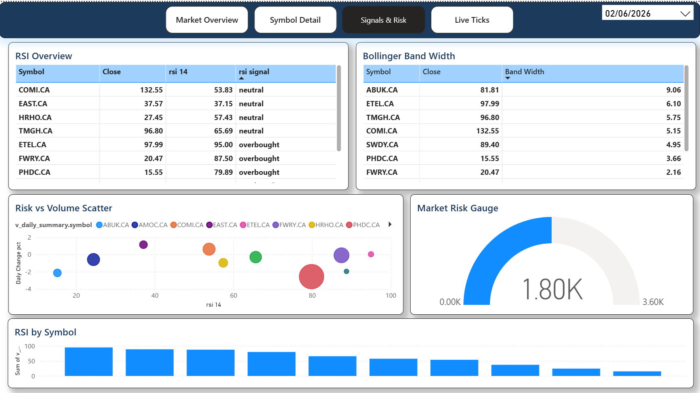

# Signals & Risk Page

> Cross-market risk assessment — RSI screening, Bollinger Band width ranking, risk-return scatter, and an aggregate risk gauge.

## Data Source

| Hive View | Purpose |
|---|---|
| `v_rsi_signals` | RSI-14 values with overbought/oversold/neutral labels |
| `v_bollinger_squeeze` | Bollinger Band width per symbol (upper − lower) |
| `v_daily_summary` | Daily change %, RSI, volume for scatter plot |

## Filters

| Filter | Type | Behaviour |
|---|---|---|
| **Date Slicer** | Dropdown (top-right) | Filters all visuals to a specific trading date |

## Visuals

### RSI Overview (Table)
- **Type**: Table visual
- **Columns**: `symbol`, `close`, `rsi_14`, `rsi_signal`
- **Conditional Formatting**: `rsi_signal` column is colour-coded — red for overbought, blue for oversold, default for neutral
- **Purpose**: At-a-glance RSI screening table. Allows quick identification of stocks at momentum extremes across the entire tracked universe.

### Bollinger Band Width (Table)
- **Type**: Table visual
- **Columns**: `symbol`, `close`, `band_width`
- **Sort**: Descending by `band_width`
- **Purpose**: Stocks with the widest Bollinger Bands are experiencing the highest volatility. Conversely, narrow bands (squeeze) signal an impending breakout. This table ranks stocks by current volatility.

### Risk vs Volume Scatter (Scatter Chart)
- **Type**: Scatter chart
- **X-Axis**: `rsi_14`
- **Y-Axis**: `daily_change_pct`
- **Size**: `volume` (bubble size proportional to trading volume)
- **Legend**: `symbol` (colour-coded per stock)
- **Purpose**: Maps each stock's momentum (RSI) against its daily return, with bubble size reflecting liquidity. Stocks in the top-right quadrant (high RSI, positive change) are in strong bullish runs; bottom-right (high RSI, negative change) may be reversing. Top-left (low RSI, positive change) could signal a recovery bounce.

### Market Risk Gauge (Gauge Visual)
- **Type**: Gauge
- **Value**: Aggregate risk score (sum or weighted average of RSI deviations from neutral)
- **Min**: 0
- **Max**: 3,600 (theoretical max: 10 stocks × 360 max deviation units)
- **Purpose**: Single-number aggregate risk indicator for the tracked market. Higher values indicate more stocks at momentum extremes (either overbought or oversold), suggesting elevated market-wide risk.

### RSI by Symbol (Column Chart)
- **Type**: Clustered column chart
- **X-Axis**: `symbol`
- **Y-Axis**: `rsi_14`
- **Reference Lines**: 70 (overbought) and 30 (oversold) thresholds
- **Purpose**: Visual comparison of RSI values across all tracked stocks. Bars exceeding the 70 line are overbought; bars below 30 are oversold.
